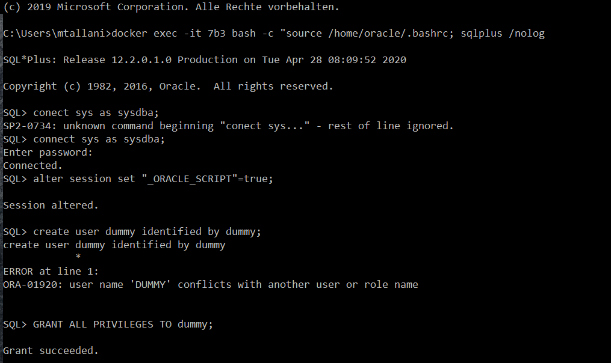
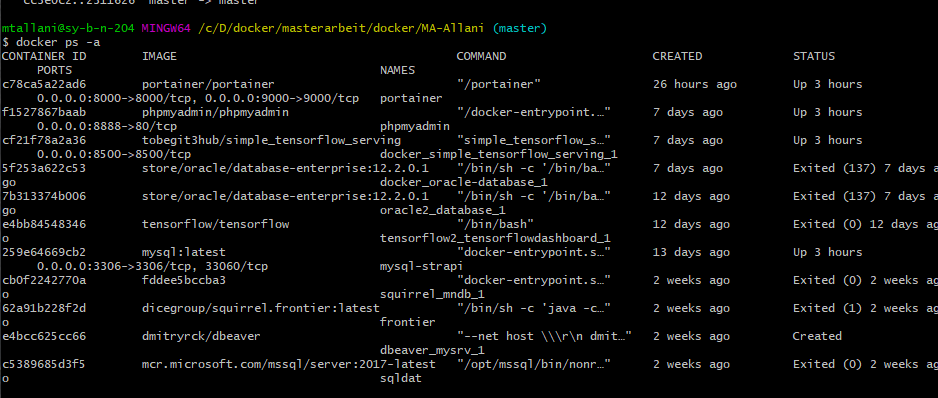

# AI-Lab Syncwork


## Erläuterung

Dieses Compose File  stellt die folgenden Services zur Verfügung:
* Oracle Database
* TensorFlow
* Jupyter Notebook
* RStudio
* Portainer
* dataiku

> Um die Services auszuführen,  muss die Software **Docker** auf dem Rechner installiert sein (Falls Docker noch nicht installiert ist: [hier!](https://www.docker.com/) ist die Dokumentation )und seine Kommandobefehle ausgeführt werden können. Mit dem Befehl `docker version` ist es anzuschauen, dass Docker eingerichtet  ist und auf welche Version ausgeführt wird (Die Art des Kommandozeileninterpreters  bleibt dem Nutzer überlassen  :slightly_smiling_face: ). 


> Dabei  ist es wichtig, mit dem **Docker Hub** Konto verbunden zu  sein. Der Befehl `docker login docker.io` dient zum einloggen ins Nutzerkonto. Hierbei wird das Username und das Passwort benötigt.


> Jetzt muss dieser Ordner  heruntergeladen  und im  Kommandozeileninterpreter geöffnet werden.

> Der Kommandobefehl `docker-compose up` dient zur Ausführung der oben genannten  Services. Im hintergrund wird die  von Docker  Befehle **pull**  und  **run** ausgeführt,  um die Docker Images  von Docker hub zu pullen und die entsprechenden Container  in den geeigneten Port auszuführen, die im **Docker-compose.yml**  file festgestellt wurden.

> Die Services werden in den folgenden Port ausgeführt:

 - Oracle Database: 1531
 - TensotFlow: 8500
 - Jupyter Notebook: 8880
 - RStudio: 8787
 - Portainer: 9000
 - dataiku: 10000


Zum Beispiel ist das Service Jupyter Notebook auf **localhost:8080** verfügbar.


Falls es nicht möglich ist, die Images auf **Localhost** auszuführen, ist  der Befehl `docker-machine ip default` auszuführen,  um die Docker Toolbox IP Adresse anzeigen zu lassen.

Wenn die Services aufgehört werden müssen,  soll der Kommandobefehl `docker-compose down` im selben Ordner ausgeführt werden. 

## Ausführungseklärung

#### RStudio
Es wird dabei die Zugangdaten  gebraucht:
 * Username: rstudio
 * Passwort:  ES-BEFINDET-SICH-IM-YML-FILE hat man als neuer Mitarbeiter von Peggy
 
 

#### Jupyter Notebook
Beim Verwenden des Service **Jupyter Notebook**, wird es das Token gebraucht. Welches in der Kommandozeile angezeigt wird. 
In meinem Fall ist:  8ff41e982482335d8c3b763635a4d6a8e42229a24ad240de


#### Tensorflow

#### Oracle Database ([Für mehr Informationen!](https://hub.docker.com/_/oracle-database-enterprise-edition))

1. Zum Zeigen die Protokolle des Oracle-Containers 

```

docker logs -f d66

```
 
d66: ist  die erste 3 Zifferm vom Oracle-Container, oder kann  der name des Containers geschrieben werden

2. Zum Ausführen bestimmter Befehle  im Container mit hilfe Kommandozeileninterpreter

```

docker exec -it d66  bash -c "source /home/oracle/.bashrc; sqlplus /nolog"

```

3. Die Erstellung einer Verbindung mit der Datenbank 

```

connect sys as sysdba;

```
 
4. Passwort eingeben (Das sich im YML File befindet) <br>

5. Um Oracle -Befehle ausführen zu eraluben
 
```

alter session set "_ORACLE_SCRIPT"=true;

```

6. Die Erstellung eines neuen  Users

```

create user dummy identified by dummy;

```

7. Um dem User alles privilege zu geben


```

GRANT ALL PRIVILEGES TO dummy;

```



#### Portainer

> In dem Fall, dass man die nicht mit den Kommandobefehlen arbeiten will, kommt hier das Image **Portainer**  zum Einsatz. **Portainer**
 ist ein Docker-Image, das zur graphischen verwaltung von Docker-Container dient.
 
 * Dabei wird benötigt, ein neues Volume zu erstellen.
 
 ```
 
 docker volume create portainer_data
 
 ```
 
 * Das Service **Portainer** steht unter **localhost:9000** zur Verfügung.
 
 
 
 #### Dataiku
 
 * Dabei wird nur das Anmelden mit dem dataiku-Konto gebraucht :wink:
 
 * Das Service **Dataiku** steht unter **localhost:10000** zur Verfügung.
 


## Noch nützliche Befehle:  :wink:

- ein Bestimmtes Container löschen:


```

Docker rm <CONTAINER-NAME>

```

Hinw: Statt `<CONTAINER-NAME>` können die ersten 3 Ziffern  von der Container Id geschrieben werden. 

==> In dem Fall, dass das Container nicht gelöscht werden kann, muss es zuerst gestoppt werden (`Docker stop <CONTAINER-NAME>`  Um das  Container zu pausieren), oder die Option `–-force` hinzufügen. (Z.B `docker rm  f65 --force`).


- Ein Bestimmtes Image löschen:

```

Rocker rmi   <IMAGE-NAME-ODER-IMAGE-ID>

```

Hinw: Statt  `<CONTAINER-NAME>` können die ersten 3 Ziffern  von der “Image ID“ geschrieben werden. 

==>	In dem Fall, dass das Image nicht gelöscht werden kann, muss es zuerst gestoppt werden (`Docker stop <Image-NAME>`). Oder die Option `–-force` hinzufügen. (Z.B  `docker rmi  723 --force`).

Das passiert, wenn man eine Image löschen will, während ein Container von diesem Image gleichzeitig läuft.


- Das  Anzeigen aller Image, die auf dem Rechner benutzt werden können

```

docker images

```


* Das Anzeigen aller auf dem Rechner laufenden Container (Beim Hinzufügen  `–a` werden die pausierten Container auch mit gezeigt) 

```

docker ps -a

```


